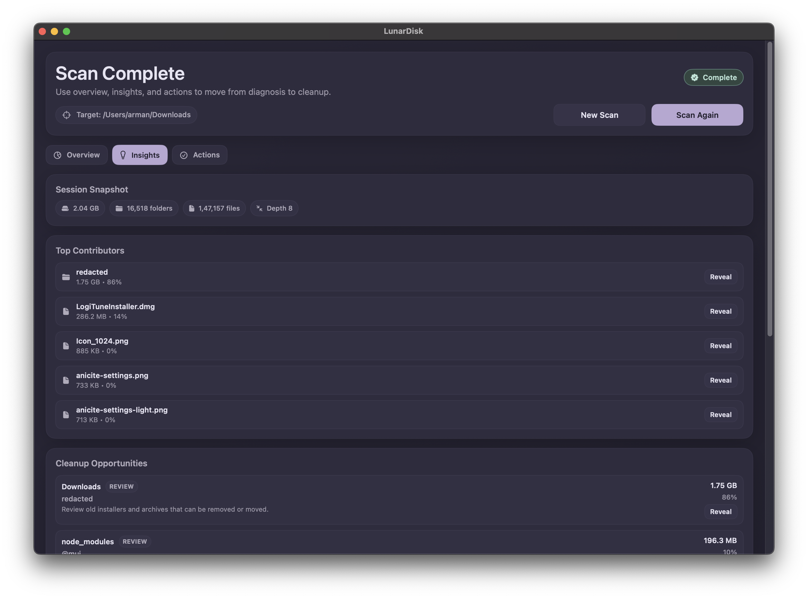

# LunarDisk

LunarDisk is a macOS-only, open-source disk usage visualizer focused on helping users find and clean large storage consumers safely.

## Product Summary

- Goal: quickly surface storage-heavy files/folders and let users clean up safely.
- Users: Mac users low on space, plus developers/power users needing trusted breakdowns.
- Core flow: pick folder/volume -> recursive scan -> visual + sortable size breakdown -> drill down/rescan.
- Privacy: local-first, least-privilege filesystem access, no file-content collection/transmission, minimal settings/scan metadata only.

## Architecture

- `App/` (SwiftUI app orchestration), `Modules/CoreScan/` (scanner + size model), `Modules/Visualization/` (chart/layout), `Modules/LunardiskAI/` (local heuristics), `scripts/` (CLI workflow).

## Install

- Latest release: [GitHub Releases](https://github.com/CarboxyDev/Lunardisk/releases)

## Workflow

- Prereq: install Xcode command-line tools and XcodeGen (`brew install xcodegen`).
- Commands: `./scripts/gen.sh`, `./scripts/build.sh`, `./scripts/test.sh`, `./scripts/run.sh`, `./scripts/release-dmg.sh`, `./scripts/reset-state.sh [onboarding|all]`, `./scripts/clean.sh`.
- `Lunardisk.xcodeproj` is generated from `project.yml` and can be recreated anytime.

## Product Preview

